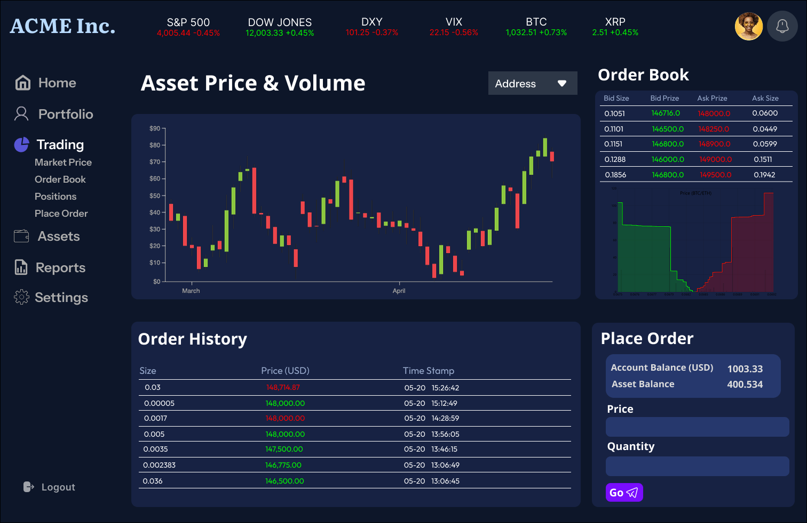
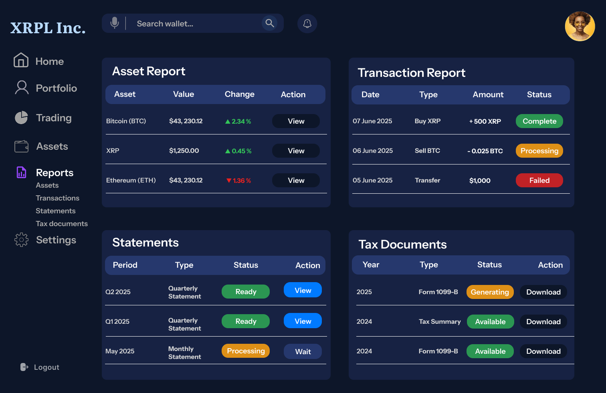

# XRP-Ledger Asset Manager

A modular Java-based asset management system for the XRP Ledger, built with a service-oriented architecture.

## Overview

This project provides a comprehensive asset management solution for the XRP Ledger, implementing various services for account management, wallet operations, blockchain interactions, and key management. The system is designed with a clear separation of concerns using Service Provider Interfaces (SPIs) and their implementations.

Demo Video: https://youtu.be/MHx7r6VOYDU?si=7H3dhYueSQqJ2WU5

Testnet Transaction: https://testnet.xrpl.org/accounts/rn896CjbZNTcVaPMy6gs6WPKnbdcNS4tju







## Project Structure

The project is organized into several modules:

- **account-service**: Account management functionality
  - `account-service-spi`: Service Provider Interface
  - `account-service-impl`: Implementation

- **wallet-service**: Wallet operations
  - `wallet-service-spi`: Service Provider Interface
  - `wallet-service-impl`: Implementation

- **blockchain-service**: Blockchain interactions
  - `blockchain-service-spi`: Service Provider Interface
  - `blockchain-service-impl`: Implementation

- **key-management-service**: Key management operations
  - `key-management-service-spi`: Service Provider Interface
  - `key-management-service-impl`: Implementation

- **common**: Shared utilities and common code
- **app**: Main application module

## Application Architecture


Technical Walkthrough Video: https://youtu.be/xWWmdAvHYEg?si=KK5A5gUtmay_IFDj

## Requirements

- Java 11 or higher
- Maven 3.6 or higher


## Building the Project

To build the project, run:

```bash
mvn clean install
```

## Development

The project uses:
- Maven for dependency management and building
- JUnit 5 for testing
- SLF4J for logging
- Google Checkstyle for code style enforcement
- xrpl4j https://github.com/XRPLF/xrpl4j


## License

This project is licensed under the terms included in the LICENSE file.

## Contributing

1. Fork the repository
2. Create a feature branch
3. Commit your changes
4. Push to the branch
5. Create a Pull Request

## Code Style

The project follows Google Java Style Guide. Code style is enforced using the Maven Checkstyle plugin.
